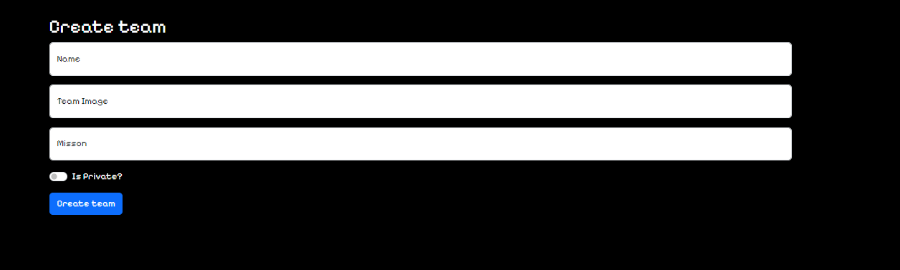

# Org Organizer  

This app is a place to organize your favorite E-sports teams and rosters! 

## Features 
- When a member is added using the member form, they are added to the member page and the corresponding team page
- When a team is added using the team form, they are able to be made public or private
- This app is integrated with firebase and google sign-in
- Full teams and/or individual members can be created, read, updated, and deleted
- A profile page displays the users name, email, and picture is displayed

## Relevant Links <!-- Link to all the things that are required outside of the ones that have their own section -->
- [Check out the deployed site](#https://johnnysaniat-orgorganizer.netlify.app/)
- [Wireframes](#https://dbdiagram.io/d/652d8219ffbf5169f0cc1974)
- [Project Board]

## Project Screenshots <!-- These can be inside of your project. Look at the repos from class and see how the images are included in the readme -->

## Contributors
- [Johnny Saniat](https://github.com/JohnnySaniat)
